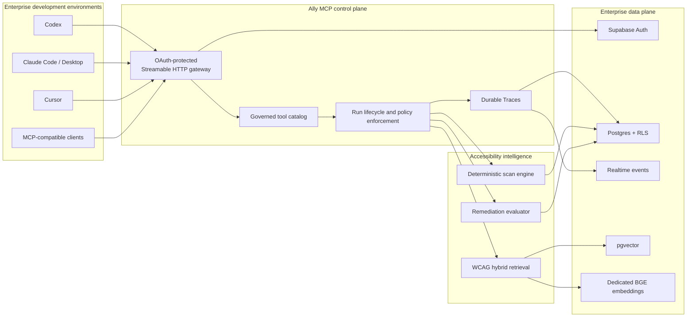
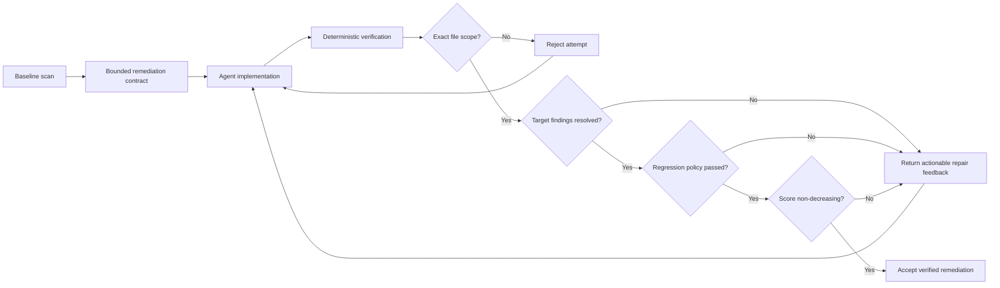
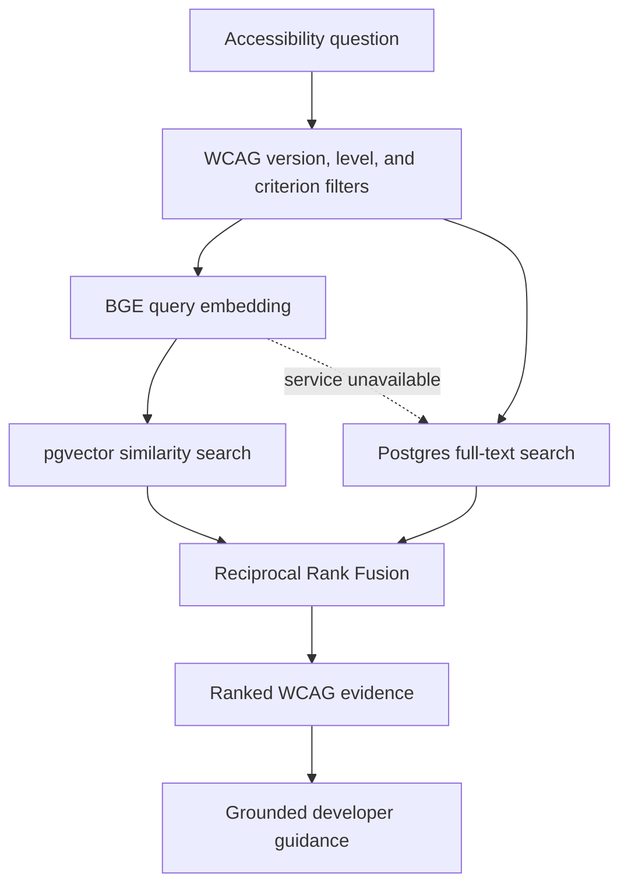
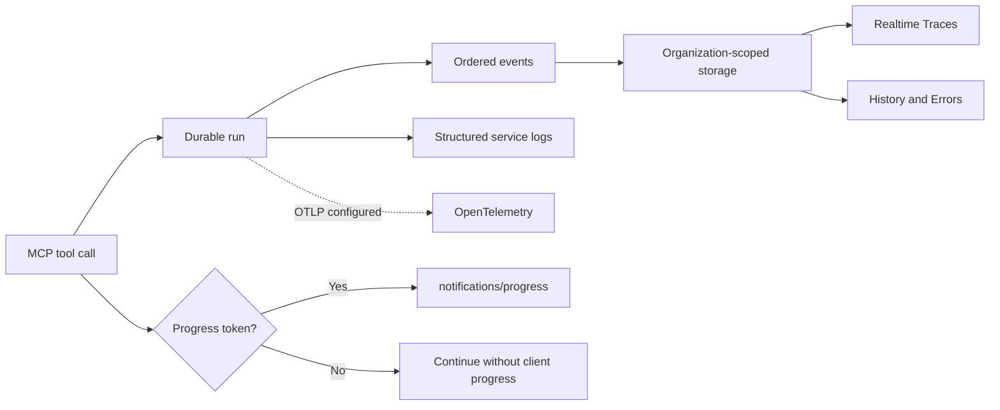

# Ally MCP

## Enterprise accessibility engineering for AI-assisted development

Ally MCP is an enterprise Model Context Protocol service that gives AI coding
agents a governed accessibility engineering capability.

It connects Codex, Claude, Cursor, and other MCP-compatible clients to
deterministic WCAG scanning, grounded standards retrieval, controlled
remediation planning, and evidence-based fix verification. Ally turns
accessibility from a late-stage audit into a continuous engineering control
inside the development workflow.

**Service endpoint**

```text
https://mcp-ally-server.vercel.app/api/mcp
```

## Business outcomes

- Detect accessibility defects while code is being developed.
- Give engineering teams consistent, WCAG-grounded remediation guidance.
- Replace subjective AI approval with deterministic verification gates.
- Preserve an auditable record of scans, plans, attempts, and outcomes.
- Standardize accessibility workflows across coding agents and repositories.
- Reduce manual handoffs between developers and accessibility specialists.

## Enterprise service architecture



Ally uses two complementary MCP execution planes:

| Execution plane | Purpose | Source access |
| --- | --- | --- |
| Hosted MCP | Universal enterprise service for search, supplied-source scanning, planning, verification, and traceability | Only source explicitly supplied in a tool request |
| Local MCP | Controlled repository execution for filesystem discovery, Playwright runtime checks, and approved test gates | Customer-controlled local workspace |

The hosted service is stateless at the transport layer. Durable product state
is stored under organization isolation in Supabase.

## Secure MCP connectivity

Interactive clients connect through OAuth 2.1. Ally publishes protected
resource metadata, delegates authorization to Supabase Auth, and presents an
Ally consent screen before a coding agent can access the service.

```mermaid
sequenceDiagram
    participant C as MCP client
    participant A as Ally MCP
    participant I as Supabase Auth
    participant U as Enterprise user

    C->>A: Initialize MCP connection
    A-->>C: 401 + protected-resource metadata
    C->>A: Discover authorization server
    C->>I: Dynamic client registration
    C->>I: Authorization request
    I->>U: Authenticate user
    U->>A: Review Ally consent
    A->>I: Approve authorization
    I-->>C: Authorization code and access token
    C->>A: Authenticated MCP request
    A->>A: Enforce organization scope and tool policy
    A-->>C: MCP result and progress
```



### Codex

```bash
codex mcp add ally --url https://mcp-ally-server.vercel.app/api/mcp
codex mcp login ally --scopes email
codex mcp get ally
```

### Claude Code

```bash
claude mcp add --transport http --scope local ally \
  https://mcp-ally-server.vercel.app/api/mcp
claude mcp login ally
claude mcp get ally
```

Claude Desktop uses the same endpoint as a custom connector. Cursor and other
clients can connect through any standards-compatible Streamable HTTP MCP
configuration.

Account-scoped API keys remain available for CI and approved non-interactive
clients. OAuth is the standard connection path for interactive users.

## Governed MCP tool catalog

### Understand

| Tool | Enterprise capability |
| --- | --- |
| `search_wcag` | Search WCAG knowledge with metadata-filtered semantic and lexical retrieval |
| `explain_finding` | Ground a defect and its safest correction in relevant WCAG evidence |

### Scan

| Tool | Enterprise capability |
| --- | --- |
| `scan_accessibility` | Scan explicitly supplied HTML, JavaScript, TypeScript, JSX, or TSX and persist the resulting report |

### Remediate

| Tool | Enterprise capability |
| --- | --- |
| `plan_fixes` | Create a durable remediation contract with exact scope and acceptance requirements |
| `record_progress` | Publish implementation milestones to the organization trace |
| `verify_fixes` | Re-scan the contracted file set and deterministically accept, reject, or escalate the attempt |

### Inspect

| Tool | Enterprise capability |
| --- | --- |
| `list_scans` | List recent scans in the authenticated organization |
| `get_findings` | Read findings from an organization-owned scan with severity filtering |
| `get_ally_health` | Inspect MCP authentication, retrieval health, latency, and hosted capabilities |

Compatibility aliases are retained for existing integrations:

- `search_wcag_knowledge` → `search_wcag`
- `scan_source_files` → `scan_accessibility`

## Deterministic remediation assurance

Ally separates AI-generated implementation work from acceptance decisions. A
coding agent can propose and apply a fix, but Ally's evaluator determines
whether the contracted result passes.



Hosted remediation contracts:

- Permit at most three verification attempts.
- Require the exact baseline file set.
- Reject unchanged and out-of-scope submissions.
- Reject new moderate-or-higher findings.
- Allow no more than two new minor findings.
- Require a non-decreasing accessibility score.
- Preserve deterministic verdicts and sanitized evidence.

Local MCP deployments can add Playwright, axe-core, custom runtime checks, and
explicitly approved project test scripts to the same verification contract.

## WCAG retrieval

Ally combines semantic and lexical retrieval so coding agents can answer both
conceptual accessibility questions and exact technical criteria.



The dedicated BGE service generates normalized 1,024-dimensional query vectors.
Supabase performs metadata-filtered hybrid retrieval. If semantic retrieval is
unavailable, Ally falls back to ranked lexical search instead of failing the
tool call.

## Enterprise Traces

Every hosted MCP tool runs through a common lifecycle wrapper:

1. Authenticate the connection and resolve organization ownership.
2. Create a durable tool run.
3. Record ordered start, milestone, completion, failure, or cancellation events.
4. Publish native MCP progress when the client supplies a progress token.
5. Stream organization-authorized updates to the Traces workspace.
6. Emit structured operational logs and optional OpenTelemetry spans.



Traces expose tool identity, status, progress, stage, duration, connection,
project, parent workflow, contract, attempts, sanitized inputs, actions, and
outputs. Completed activity telemetry is retained for 30 days; scans, findings,
contracts, and evaluation evidence follow product data-retention policy.

## Security and governance

- **OAuth 2.1 authorization:** browser-based authorization for interactive MCP
  clients.
- **Tenant isolation:** Supabase row-level security protects
  organization-owned data.
- **Scoped credentials:** API keys are hashed and displayed in full only at
  creation.
- **Controlled source handling:** hosted tools process submitted source in
  memory and do not persist source content.
- **Sanitized telemetry:** credentials, prompts, source, and snippets are
  excluded from logs and OpenTelemetry spans.
- **Deterministic evaluation:** acceptance is based on scanner output, regression
  policy, scope, and score—not an LLM grader.
- **Cancellation support:** cancelled MCP calls stop work, record the cancelled
  state, and do not return stale success.
- **Idempotent events:** run and event idempotency prevents duplicate enterprise
  activity records.
- **Cascade deletion:** account deletion removes associated organization data,
  credentials, scans, findings, contracts, attempts, and MCP activity.

## Data boundary

Hosted scan, plan, and verify calls persist:

- file paths and content hashes
- finding metadata and stable match keys
- WCAG references and retrieved excerpts
- remediation targets and contract scope
- attempt verdicts and sanitized feedback
- MCP run status, progress, duration, and events

Hosted calls do not persist submitted source content.

## Service reliability model

- Static hosted tool catalog with backward-compatible aliases.
- Streamable HTTP MCP transport.
- Durable state independent of serverless instance lifetime.
- Native client progress when supported.
- Realtime product updates with snapshot recovery.
- Five-second Trace polling fallback only when Realtime is unavailable.
- Lexical WCAG fallback when the embedding service is unavailable.
- Structured failures returned as MCP `isError: true` results.
- Monotonic progress and explicit cancellation state.

Ally does not continuously poll connected repositories or run autonomous
background scans. A scan or verification begins only through an explicit MCP
tool call.

## Enterprise deployment model

The Ally control plane consists of:

- a hosted MCP and authorization gateway
- an organization workspace and Traces interface
- Supabase Auth, Postgres, Realtime, RLS, and pgvector
- a private BGE embedding service
- a configured completion provider for assistant synthesis
- optional OpenTelemetry export for enterprise observability

The embedding service must be reachable from the hosted MCP environment and
should remain private. If it is unavailable, WCAG retrieval continues through
the lexical fallback.

## Enterprise onboarding checklist

1. Provision the customer organization and authorized users.
2. Configure the production OAuth origin and callback allowlist.
3. Validate protected-resource and authorization-server discovery.
4. Connect the approved MCP clients through OAuth.
5. Define API-key policy for CI and other non-interactive integrations.
6. Confirm organization RLS and account-deletion behavior.
7. Run an end-to-end scan, remediation plan, failed verification, repair, and
   passing verification.
8. Confirm the complete workflow appears in Traces.
9. Configure telemetry export and retention requirements when applicable.

## License

UNLICENSED — Proprietary.
