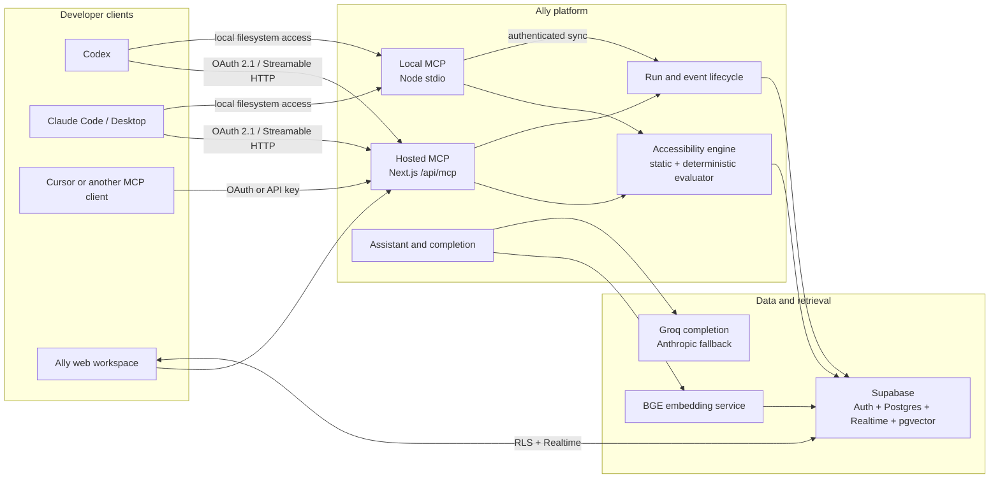
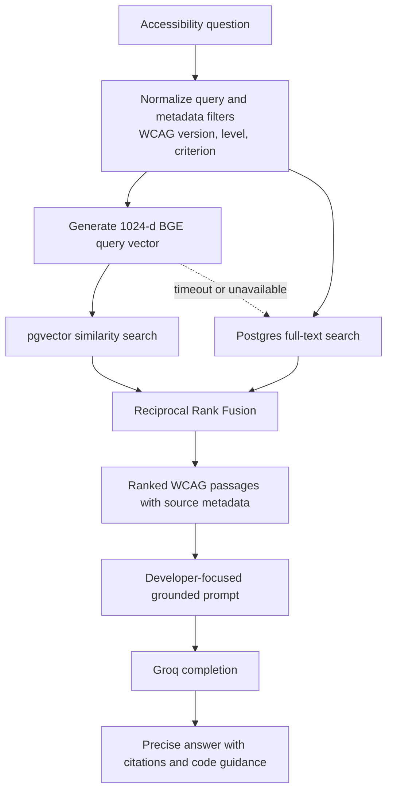
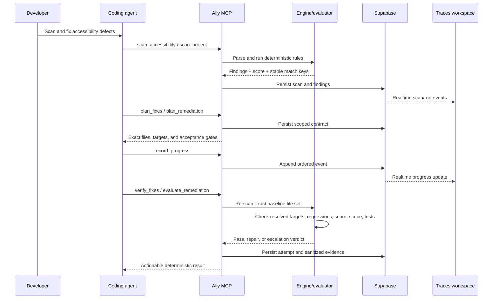
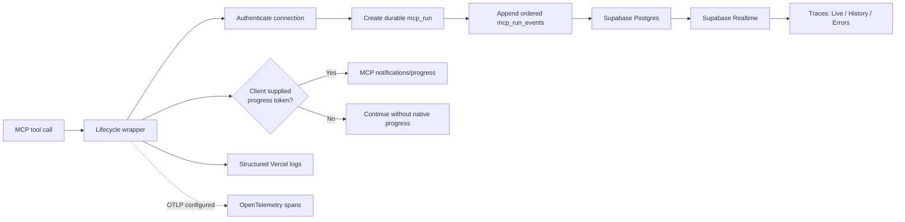

# Ally

Ally is an accessibility engineering platform that connects an AI coding agent
to deterministic WCAG scanning, grounded guidance, remediation planning, fix
verification, and a durable Traces dashboard.

It is designed as a closed feedback loop:

> Understand → Scan → Plan → Implement → Verify → Repeat

The AI agent coordinates the work. Ally's engine and evaluator decide whether
the accessibility result actually improved.

## What Ally includes

- A static accessibility engine for HTML, JavaScript, TypeScript, JSX, and TSX.
- Optional Playwright, axe-core, custom runtime checks, and approved test gates.
- Hosted and local Model Context Protocol (MCP) servers.
- OAuth 2.1 browser authorization for interactive hosted MCP clients.
- Metadata-filtered WCAG hybrid search with a lexical fallback.
- Deterministic remediation contracts and three-attempt verification.
- A Next.js workspace for projects, findings, API keys, assistant chat, and
  real-time MCP traces.
- A dedicated BGE embedding service for scalable query embeddings.

Ally does **not** continuously watch a repository or poll for code changes.
Scans and verifications run only when a user or connected coding agent invokes
the corresponding tool.

## System architecture



### Hosted versus local MCP

| Capability | Hosted MCP | Local MCP |
| --- | --- | --- |
| Transport | Streamable HTTP | stdio |
| Authentication | OAuth 2.1; API key fallback | Local process plus Ally API key for sync |
| Source input | Explicit files supplied by the client | Direct filesystem discovery |
| Static scan | Yes | Yes |
| Runtime browser scan | No | Yes, with Playwright |
| Project test scripts | No | Yes, allowlisted in `ally.config.json` |
| Durable Traces | Yes | Yes, when connected to the Ally API |
| Best use | Universal remote connection | Deep repository evaluation |

The hosted server is stateless between requests. Supabase stores durable scans,
findings, remediation contracts, attempts, MCP runs, and ordered events.

## Repository structure

```text
.
├── apps/
│   └── web/                 # Next.js workspace, hosted MCP, OAuth, APIs
├── packages/
│   ├── engine/              # Static scanner, runtime scanner, evaluator
│   ├── mcp/                 # Local stdio MCP and remediation harness
│   └── shared/              # Shared schemas and domain types
├── services/
│   └── bge/                 # FastAPI BGE embedding service
├── docs/
│   └── architecture/        # Detailed implementation notes
├── scripts/
│   └── dogfood.mjs          # Scans Ally with its own engine
├── compose.yml              # Web + BGE local/server stack
├── Dockerfile               # Standalone Next.js production image
└── ally.config.json         # Local scan/evaluation defaults
```

## Fresh-clone setup

### Prerequisites

- Node.js 22 (`.nvmrc` is included).
- pnpm 9.15 through Corepack.
- A Supabase project with Auth, Postgres, Realtime, and pgvector.
- Docker Desktop when running the BGE service or complete Compose stack.
- A Groq API key for assistant completion. Anthropic is an optional fallback.
- Supabase CLI when applying migrations from the repository.

### 1. Clone and install

```bash
git clone https://github.com/iaamar/allyMCP.git
cd allyMCP

nvm use
corepack enable
pnpm install --frozen-lockfile
```

### 2. Create the centralized environment file

Ally loads one root `.env` file for the web app, MCP package, and Compose stack.

```bash
cp .env.example .env
```

Fill in the required Supabase and completion-provider values. Never commit
`.env`; only `.env.example` belongs in Git.

| Variable | Required | Purpose |
| --- | --- | --- |
| `NEXT_PUBLIC_SUPABASE_URL` | Yes | Supabase project URL |
| `NEXT_PUBLIC_SUPABASE_PUBLISHABLE_KEY` | Yes | Browser-safe Supabase key |
| `SUPABASE_SECRET_KEY` | Yes | Server-only Supabase secret/service key |
| `NEXT_PUBLIC_SITE_URL` | Yes | Public Ally origin; localhost in development |
| `GROQ_API_KEY` | Recommended | Primary assistant completion provider |
| `GROQ_MODEL` | No | Defaults to `qwen/qwen3.6-27b` |
| `ANTHROPIC_API_KEY` | No | Optional completion fallback |
| `ANTHROPIC_MODEL` | No | Optional Anthropic model override |
| `BGE_EMBEDDING_URL` | Recommended | BGE service URL |
| `BGE_EMBEDDING_TOKEN` | Production | Shared private BGE service token |
| `BGE_REQUEST_TIMEOUT_MS` | No | Embedding request timeout |
| `CRON_SECRET` | Production | Protects the telemetry cleanup route |
| `OTEL_EXPORTER_OTLP_ENDPOINT` | No | Optional OpenTelemetry collector |

### 3. Apply the Supabase migrations

From the repository root:

```bash
cd apps/web
pnpm dlx supabase link --project-ref YOUR_PROJECT_REF
pnpm dlx supabase db push
cd ../..
```

The migrations create the product schema, WCAG vector retrieval, durable
remediation contracts, MCP runs/events, RLS policies, indexes, and Realtime
publication. The latest migration removes the retired scan-request polling
queue and agent heartbeat table.

Do not edit historical migrations after they have been applied. Add a new
migration for every schema change.

### 4. Configure Supabase Auth and OAuth

In Supabase:

1. Set the Site URL to `http://localhost:3000` for local development.
2. Add `http://localhost:3000/auth/callback` to the redirect allowlist.
3. Enable the OAuth 2.1 server.
4. Set the authorization/consent path to
   `http://localhost:3000/oauth/consent`.
5. For production, add the equivalent HTTPS site and callback URLs.

Ally publishes protected-resource metadata at:

```text
/.well-known/oauth-protected-resource
/.well-known/oauth-protected-resource/api/mcp
```

The authorization server is Supabase Auth. Ally owns the consent screen and
the protected MCP resource.

### 5. Start local development

Start the BGE service:

```bash
docker compose up -d embeddings
```

Then start the web workspace:

```bash
pnpm --filter web dev --port 3000
```

Open [http://localhost:3000](http://localhost:3000).

The first BGE start downloads `BAAI/bge-large-en-v1.5`. Model weights are
cached in `services/bge/.model-cache`, so later starts reuse them.

### 6. Run the complete Docker stack

```bash
docker compose up --build -d
docker compose ps
```

Local endpoints:

| Service | URL | Exposure |
| --- | --- | --- |
| Web workspace and hosted MCP | `http://localhost:3000` | Public to host |
| BGE health | `http://127.0.0.1:8080/health/ready` | Host loopback only |
| Hosted MCP | `http://localhost:3000/api/mcp` | Through web service |

Useful commands:

```bash
docker compose logs -f web
docker compose logs -f embeddings
docker compose down
```

## Connect a coding agent

Production MCP endpoint:

```text
https://mcp-ally-server.vercel.app/api/mcp
```

### Codex

```bash
codex mcp add ally --url https://mcp-ally-server.vercel.app/api/mcp
codex mcp login ally --scopes email
codex mcp get ally
```

Restart the task after registration if the new tools do not appear immediately.

### Claude Code

```bash
claude mcp add --transport http --scope local ally \
  https://mcp-ally-server.vercel.app/api/mcp
claude mcp login ally
claude mcp get ally
```

Claude Desktop uses the same endpoint as a custom connector. Sign in with the
same email address used for the Ally workspace.

### Local MCP for repository access

Build the local server:

```bash
pnpm --filter @ally/mcp build
```

Example `.mcp.json`:

```json
{
  "mcpServers": {
    "ally": {
      "command": "node",
      "args": ["/absolute/path/to/allyMCP/packages/mcp/dist/index.js"],
      "env": {
        "ALLY_PROJECT_ROOT": "/absolute/path/to/target-project",
        "ALLY_API_URL": "https://mcp-ally-server.vercel.app",
        "ALLY_API_KEY": "${ALLY_API_KEY}"
      }
    }
  }
}
```

Generate an API key from the Ally workspace only for local sync, CI, or another
non-interactive client. Interactive hosted clients should use OAuth.

## Hosted MCP tool catalog

| Phase | Tool | Purpose |
| --- | --- | --- |
| Understand | `search_wcag` | Metadata-filtered hybrid WCAG search |
| Understand | `explain_finding` | Ground a finding and safe correction in WCAG evidence |
| Scan | `scan_accessibility` | Scan explicitly supplied source and persist the report |
| Remediate | `plan_fixes` | Create a durable, bounded remediation contract |
| Remediate | `record_progress` | Publish implementation milestones to Traces |
| Remediate | `verify_fixes` | Deterministically accept, reject, or escalate an attempt |
| Inspect | `list_scans` | List recent scans in the authenticated organization |
| Inspect | `get_findings` | Read findings from an owned scan |
| Inspect | `get_ally_health` | Check auth, retrieval, latency, and capabilities |

Compatibility aliases:

- `search_wcag_knowledge` → `search_wcag`
- `scan_source_files` → `scan_accessibility`

The local MCP additionally exposes filesystem, runtime, policy, reasoning,
fix-suggestion, and dashboard-sync tools such as `scan_project`, `scan_files`,
`plan_remediation`, `evaluate_remediation`, `get_reasoning_packets`,
`get_fixes`, `resolve_reasoning`, `configure_policy`, `sync_report`, and
`sync_evaluation`.

## Retrieval architecture



The web app and local MCP call the dedicated BGE service and Supabase
`hybrid_search_wcag` RPC. If embeddings or hybrid search are unavailable, Ally
returns ranked lexical results instead of failing the assistant.

## Scan and remediation loop



Hosted contracts:

- Allow at most three verification attempts.
- Require the exact baseline file set.
- Reject unchanged or out-of-scope submissions.
- Reject new moderate-or-higher findings.
- Allow no more than two new minor findings.
- Require a non-decreasing accessibility score.
- Never persist submitted source content.

### Local runtime and test gates

Add an evaluation profile to the target project's `ally.config.json`:

```json
{
  "appUrl": "http://localhost:3000",
  "evaluation": {
    "runtime": true,
    "routes": ["/", "/login"],
    "timeoutMs": 30000,
    "testScripts": ["typecheck", "test"]
  }
}
```

Only scripts explicitly listed in `testScripts` may run as evaluator gates.

## Traces and progress



Progress is monotonic from 0–100. Native MCP progress is best-effort; Supabase
is the product-facing source of truth. The dashboard subscribes through RLS and
Realtime, with a five-second polling fallback only when Realtime disconnects.
That fallback refreshes **Trace data** and never polls a developer repository.

Completed activity telemetry is retained for 30 days. Scans, findings,
contracts, and verification attempts are not deleted by telemetry cleanup.

## Commands and validation

```bash
pnpm build                    # Build every workspace package
pnpm test                     # Run all tests
pnpm typecheck                # Type-check every workspace package
pnpm dogfood                  # Scan the Ally dashboard with Ally
pnpm --filter web test        # Web tests only
pnpm --filter @ally/mcp test  # Local MCP tests only
pnpm --filter @ally/engine test:runtime
```

Runtime tests require Playwright browser dependencies.

## Production deployment

### Vercel

The Vercel project serves both the dashboard and hosted MCP endpoint.

1. Add the required root environment variables to Production and Preview.
2. Set `NEXT_PUBLIC_SITE_URL` to the production HTTPS origin.
3. Apply additive Supabase migrations before deploying code that depends on
   them.
4. Deploy from the GitHub-connected default branch.
5. Verify:
   - `/.well-known/oauth-protected-resource`
   - `/api/mcp`
   - OAuth sign-in and consent
   - `get_ally_health`
   - a scan, plan, failed verification, repair, and passing verification
   - corresponding entries in Traces

Vercel cannot run the 1.3 GB BGE model inside a normal serverless function.
Set `BGE_EMBEDDING_URL` to a private, reachable embedding service or rely on
lexical fallback.

### Container server

On a VPS or container platform:

```bash
docker compose up --build -d
```

Keep `embeddings:8080` private on the Compose network and expose only the web
service through HTTPS. The Compose file maps the BGE port to host loopback for
diagnostics, not public access.

## Security and data handling

- OAuth access is scoped to the signed-in Ally organization.
- API keys are hashed; their full value is shown only at creation.
- Supabase RLS protects organization-owned product data.
- Source submitted to hosted scan, planning, or verification tools is processed
  in memory and is not persisted.
- Persisted evidence is limited to paths, hashes, finding metadata, targets,
  WCAG excerpts, sanitized progress, and verdicts.
- Logs and OpenTelemetry spans must never include credentials, prompts, source,
  or snippets.
- Account deletion cascades through organization-owned scans, findings,
  contracts, attempts, API keys, and MCP activity.

## Detailed architecture notes

- [Harness and retrieval architecture](docs/architecture/2026-07-24-ally-harness-rag.md)
- [Deterministic evaluator implementation](docs/architecture/2026-07-25-evaluator-implementation.md)

## License

UNLICENSED — Proprietary.
